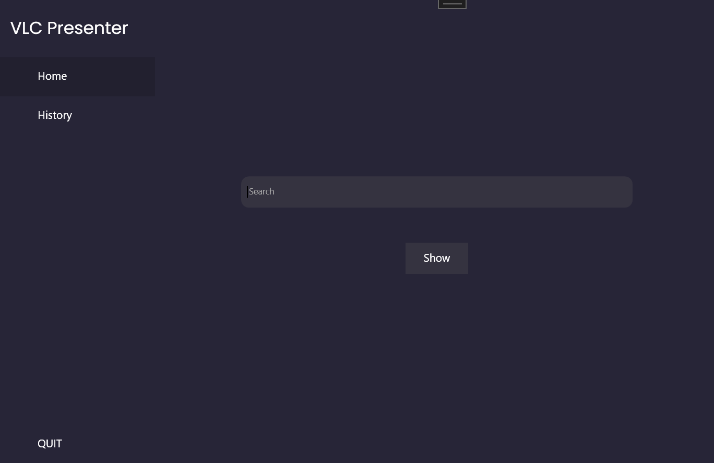
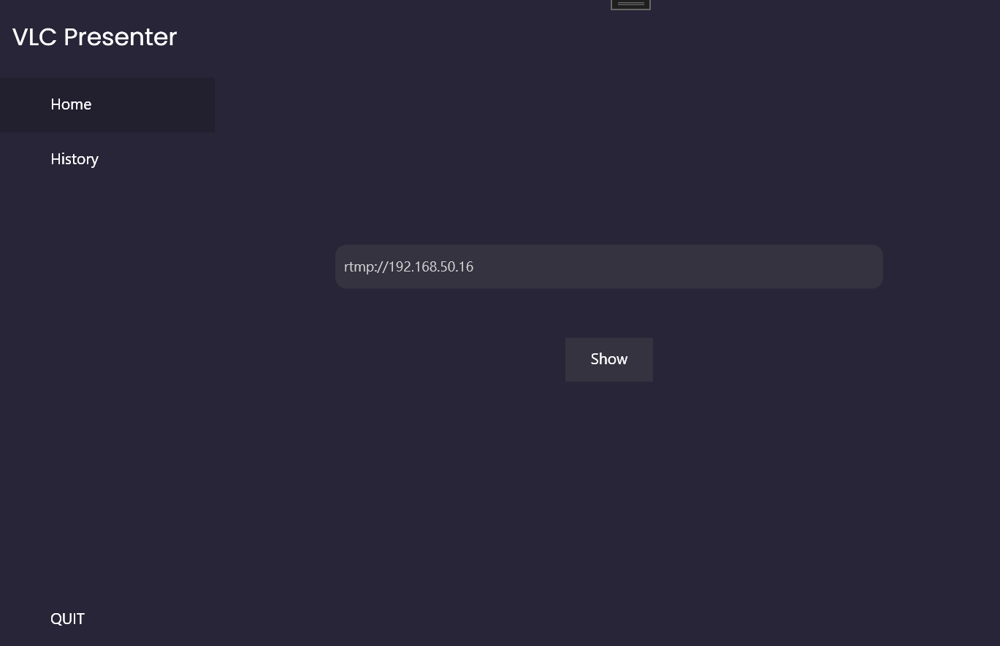
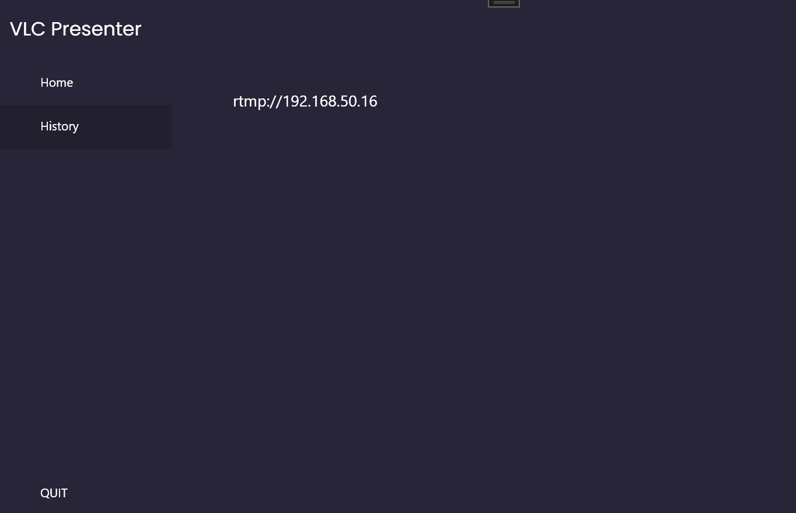

# showVLC

## Usage
* Show the source given to the application
  
* Show the history of given sources
  

## How to build project
* Environment: Visual Studio 2022
* Build the c++ dll first (must install opencv on your computer and setup in Visual Studio), and then run the c# WPF application.